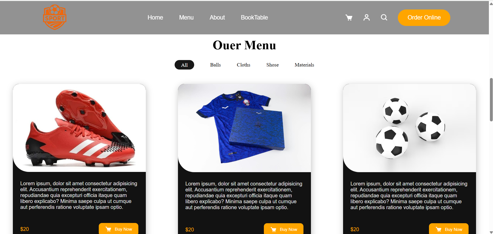
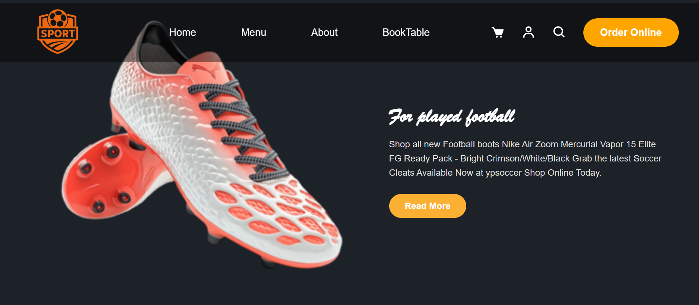
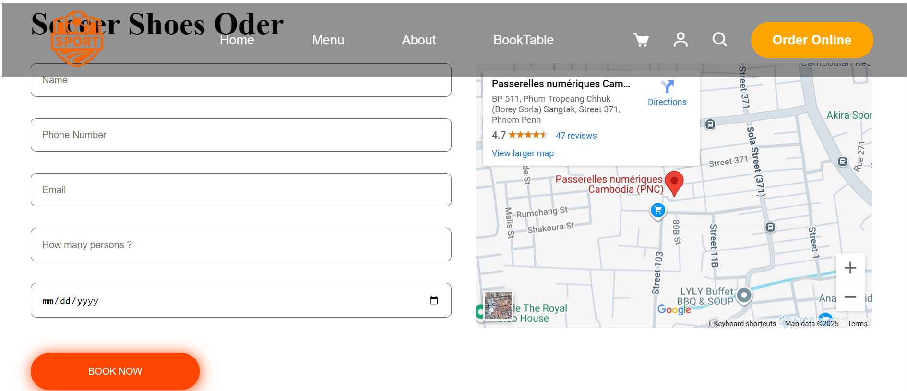
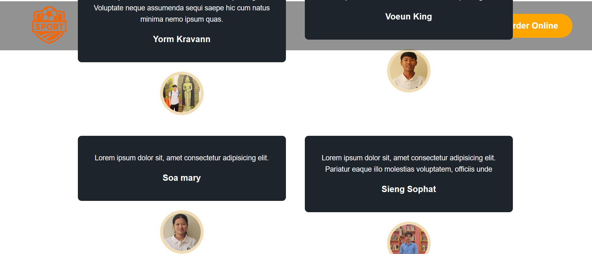
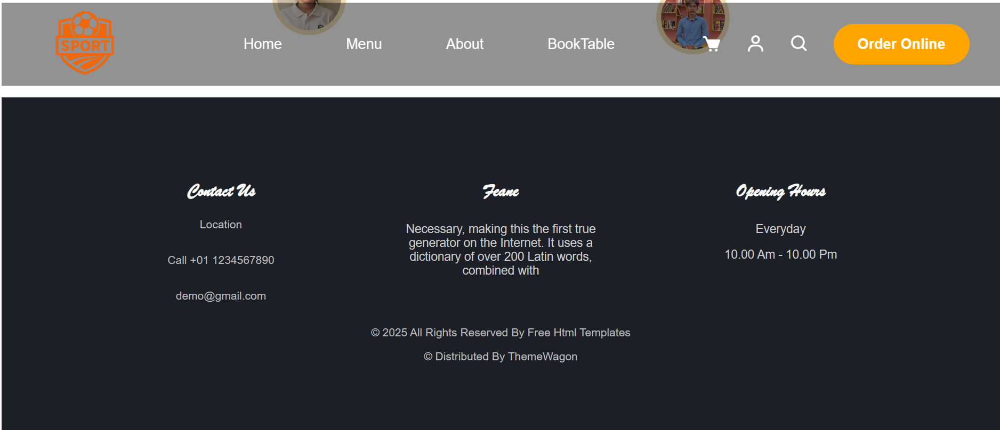

# Prosess This project 
Perpose of this project we start with different branch and then when finish we push the into mian branch.
# Member in group :
### Yorm Kravvan
### Sao Mary
### Seing Sopath
### Voeun King

# About branch
### We have ten branch :
  - main
  - feature/phat-1
  - feature/phat-2
  - feature/phat-3
  - feature/king-1
  - feature/king-2
  - feature/king-3
  - feature/Mary-1
  - feature/Mary-2
  - feature/Kravvan-1
  - feature/Kravvan-2

# About our result
### first page

### Next

### Our Product

### Our Product

### Other Form

### Member My our Team

### Footer contect

## ✨ Features

 - Orther online
 - Find materail sport
 - Log In Accunt
 - Form Other And Location
 - Button search for find buy something
 - map can put your location

## Issues
 - Merge Error 4 time 
 - Error push
 - merge code mix don't flow of code
 - Difficult when we create responsive
